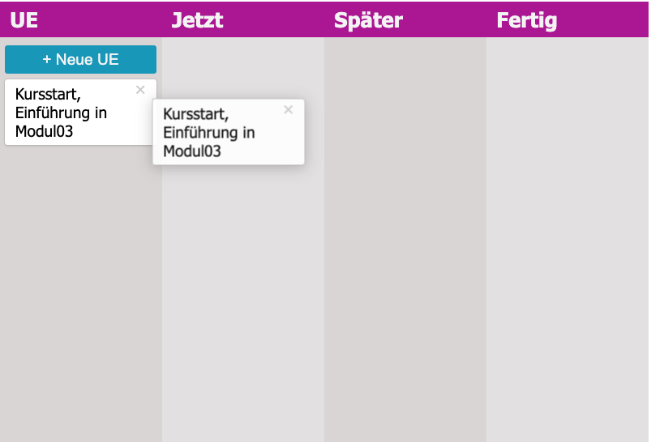

# stundenPlaner

## in Arbeit

Das Ziel dieses Studenplaners ist, Unterrichtsthemen aufzulisten, und ähnlich wie beim Kanban Board, Einheiten per drag & drop in die jeweilige Spalte zu verschieben.

